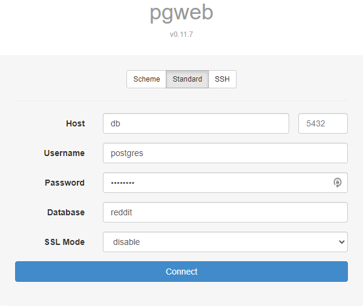

# Reddit Clone Server Docs

## Prerequisites

- nodejs

- docker-compose

## Getting Started

> be sure to run these commands in the `./server` directory

- run `npm install`

  - installs server deps

- run `docker-compose -p "reddit-clone-server" up -d`

  - initializes the docker container

## Postgres + pgweb

- Postgresql is provided using docker

- To interface with psql use a locally install psql-client cli tool or see below to use [pgweb](https://sosedoff.github.io/pgweb/)

### pgweb

- Ensure the docker-compose container is running

- Navigate [localhost:8081](http://localhost:8081) in your browser

  - Host: db

  - Username: postgres

  - Password: postgres

  - Database: reddit

  - SSL Mode: disable

